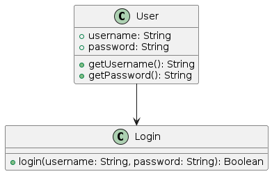
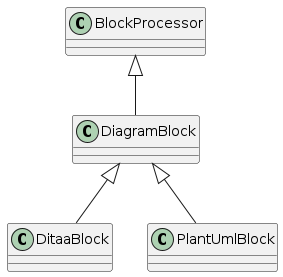

= Simple PlantUML Use Case
// Turn off --> :figure-caption!:
:source-highlighter: rouge

.Use Case Diagram

[source,java]
----
import java.util.Scanner;

public class Login {
  private boolean login(String username, String password) {
    return username.equals("admin") && password.equals("secret");
  }

  public static void main(String[] args) {
    Login login = new Login();
    Scanner scanner = new Scanner(System.in);

    System.out.print("Enter username: ");
    String username = scanner.nextLine();
    System.out.print("Enter password: ");
    String password = scanner.nextLine();

    if (login.login(username, password)) {
      System.out.println("Login successful!");
    } else {
      System.out.println("Login failed.");
    }
  }
}
----

.Class Diagram

